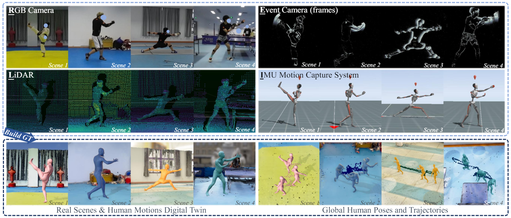
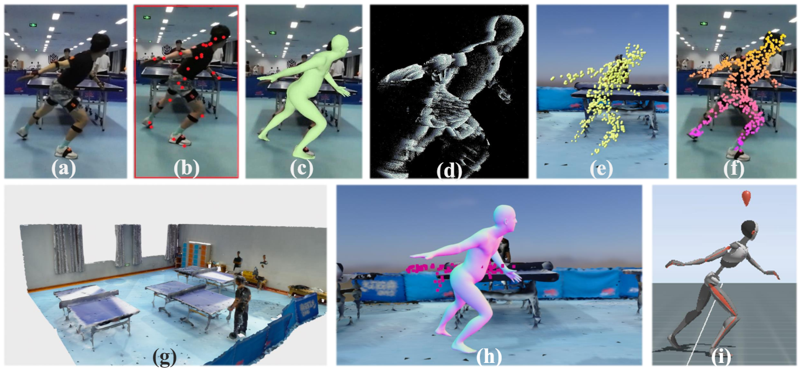

# RELI11D: A Comprehensive Multimodal Human Motion Dataset and Method [CVPR-2024]
[](https://arxiv.org/abs/2403.19501) 
[](http://www.lidarhumanmotion.net/reli11d/) 

<p float="center">
  
</p>

<!--
Check our [website](http://www.lidarhumanmotion.net/reli11d/) for our dataset **RELI11D** and further details.
-->
                   

> [**RELI11D: A Comprehensive Multimodal Human Motion Dataset and Method**](https://arxiv.org/abs/2403.19501),            
> [Ming Yan](https://yanmn.github.io/), Yan Zhang, 
Shuqiang Cai, Shuqi Fan, Xincheng Lin, [Yudi Dai](https://climbingdaily.github.io/), [Siqi Shen](https://asc.xmu.edu.cn/t/shensiqi), [Chenglu Wen](https://asc.xmu.edu.cn/t/wenchenglu), [Lan Xu](https://www.xu-lan.com/), [Yuexin Ma](https://yuexinma.me/), [Cheng Wang](https://chwang.xmu.edu.cn/)   
> *IEEE Computer Vision and Pattern Recognition, 2024* 

<!--
## Getting Started
-->
## Dataset (Click [here](http://www.lidarhumanmotion.net/reli11d/) to download)

<div align=center>

</div>
<div style="color:orange; border-bottom: 0px solid #d9d9d9;
display: inline-block;
color: #999;
padding: -2px;">

Our proposed **RELI11D** is a high-quality multimodal human motion dataset involves **L**iDAR, **I**MU system, **R**GB camera, and **E**vent camera, which records the motions of 10 actors performing 5 sports in 7 scenes, including 3.32 hours of synchronized LiDAR point clouds, IMU measurement data, RGB videos and Event steams.

## Preparation
- Download `basicModel_neutral_lbs_10_207_0_v1.0.0.pkl` and modify `model_file` in `conf/config.yaml`.
- Download our dataset and modify `RELI_DIR` in `conf/model_file.py`.
- Create the required environment.
```bash
conda create -n yourenv python==3.7
conda activate yourenv
pip install -r requirements.txt
```

## Requirement
  Our code is tested under:
  - Python: 3.7.13
  - CUDA:   12.2
  - Pytorch: 1.8.1

## Training
To train the model:
```bash
python train.py --modality_settings all # all the modalities involved in the training process
```
You could obtain all the possible training combinations for modalities by using the ‘--help’ option:
```bash
python train.py --help
```

Note that the training datasets should be downloaded and prepared before training.

There are two approaches outlined in `models/regressor.py` for using point clouds: extracting features during training or directly utilizing the pre-extracted features in the dataset.

```bash
# Choose one of the following options:
# Option 1: Use the feature of point clouds directly
pc_feature = self.encoder(data["point"])

# Option 2: Extract features during training
pc_feature = data["pc_feature"]
```

 
## Evaluation

Run the command below to test:
```bash
python eval_pc.py --ckpt_path the_path_of _pth_file --file_name the_output_path
```
You could also choose:
```bash
python eval_img.py --ckpt_path the_path_of _pth_file --file_name the_output_path
```

## Citation

```bibtex
@inproceedings{yan2024reli11d,
  title={RELI11D: A Comprehensive Multimodal Human Motion Dataset and Method},
  author={Yan, Ming and Zhang, Yan and Cai, Shuqiang and Fan, Shuqi and Lin, Xincheng and Dai, Yudi and Shen, Siqi and Wen, Chenglu and Xu, Lan and Ma, Yuexin and others},
  booktitle={Proceedings of the IEEE/CVF Conference on Computer Vision and Pattern Recognition},
  pages={2250--2262},
  year={2024}
}
```

<!--
@InProceedings{Yan_2024_CVPR,
    author    = {Yan, Ming and Zhang, Yan and Cai, Shuqiang and Fan, Shuqi and Lin, Xincheng and Dai, Yudi and Shen, Siqi and Wen, Chenglu and Xu, Lan and Ma, Yuexin and Wang, Cheng},
    title     = {RELI11D: A Comprehensive Multimodal Human Motion Dataset and Method},
    booktitle = {Proceedings of the IEEE/CVF Conference on Computer Vision and Pattern Recognition (CVPR)},
    month     = {June},
    year      = {2024},
    pages     = {2250-2262}
}

@inproceedings{yan2024reli11d,
  title={RELI11D: A Comprehensive Multimodal Human Motion Dataset and Method},
  author={Yan, Ming and Zhang, Yan and Cai, Shuqiang and Fan, Shuqi and Lin, Xincheng and Dai, Yudi and Shen, Siqi and Wen, Chenglu and Xu, Lan and Ma, Yuexin and others},
  booktitle={Proceedings of the IEEE/CVF Conference on Computer Vision and Pattern Recognition},
  pages={2250--2262},
  year={2024}
}
-->


<!--  vibe的：
## License
This code is available for **non-commercial scientific research purposes** as defined in the [LICENSE file](LICENSE). By downloading and using this code you agree to the terms in the [LICENSE](LICENSE). Third-party datasets and software are subject to their respective licenses.
-->


## References
<!--We indicate if a function or script is borrowed externally inside each file. -->Here are some great resources we 
benefit:

- Some functions are borrowed from [VIBE](https://github.com/mkocabas/VIBE) and [LiDARCap](https://arxiv.org/abs/2203.14698).
- SMPL models and layer is from [SMPL-X model](https://github.com/vchoutas/smplx).

<!--
- Some functions are borrowed from [Temporal HMR](https://github.com/akanazawa/human_dynamics).
- Some functions are borrowed from [HMR-pytorch](https://github.com/MandyMo/pytorch_HMR).
- Some functions are borrowed from [Kornia](https://github.com/kornia/kornia).
- Pose tracker is from [STAF](https://github.com/soulslicer/openpose/tree/staf).

-->


## Copyright
The RELI11D dataset is published under the [Creative Commons Attribution-NonCommercial-ShareAlike 3.0 License](https://creativecommons.org/licenses/by-nc-sa/3.0/).You must attribute the work in the manner specified by the authors, you may not use this work for commercial purposes and if you alter, transform, or build upon this work, you may distribute the resulting work only under the same license. Contact us if you are interested in commercial usage.

<!--

## Bibtex
```bash
@InProceedings{Dai_2022_CVPR,
    author    = {Dai, Yudi and Lin, Yitai and Wen, Chenglu and Shen, Siqi and Xu, Lan and Yu, Jingyi and Ma, Yuexin and Wang, Cheng},
    title     = {HSC4D: Human-Centered 4D Scene Capture in Large-Scale Indoor-Outdoor Space Using Wearable IMUs and LiDAR},
    booktitle = {Proceedings of the IEEE/CVF Conference on Computer Vision and Pattern Recognition (CVPR)},
    month     = {June},
    year      = {2022},
    pages     = {6792-6802}
}
```

 -->
